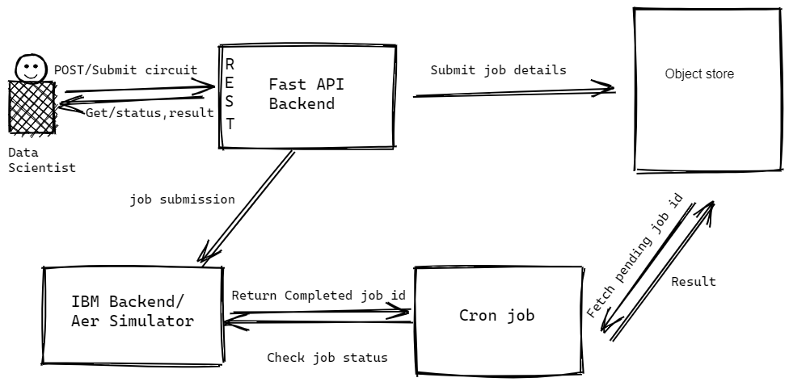

## **Asynchronous Quantum Job Framework with Object Store**
###  CS6220: Project Proposal

[Mentor: Parul Singh]

[Members: 

Saisankar Gochhayat

Rahul Ravindran

Huilian Jiang

Saisrihitha Yadlapalli

Varshitha Uppula]

## **1. Vision and Goals Of The Project:**

Unlike GPU cards, quantum acceleration is unlikely to be available as a personal computer in the near future. Right now all the known quantum computers are owned by major players. The lack of availability of quantum computers makes it beneficial to centralize the power of quantum computers, using a SaaS model to democratize access to them, therefore making the cloud a suitable home for quantum computing.

 When Quantum  Scientists use Jupyter notebooks that run on OpenShift to submit Quantum Computing circuits jobs, they must create the circuit, find an appropriate backend, and submit the jobs there.  However, such processes are error prone and the result is shown in a non persistent manner. 

The goal of the project is to offer an Asynchronous Quantum Job Framework that would create an easy interface for users to submit quantum jobs and retrieve results in an asynchronous manner. We will also build the required REST APIs in Python to expose functionality to submit a job, retrieve information about a job that has already completed and find the status of a job that is being processed.

This framework acts as a facade for the user to interact with switchable quantum workload processing backends. And also handles the burden of storing the result of quantum workloads in a secure, reliable and persistent manner. 

**2. Key Personas Of The Project:**

*   Quantum Algorithm Scientist:  
    *   Builds quantum circuits to provide algorithm-level functionality
*   Traditional Application Architect / Developer:  
    *   Builds the overall application architecture leveraging combinations of both classical and quantum algorithms. 

---

## 
**3. Scope and Features Of The Project:**

Asynchronous Quantum Job Framework

*   Setup a Backend API framework from scratch. 
*   Develop **REST API** endpoints submit/status/retriveJob
*   Research on consuming Qiskit AER simulator for simulation of quantum workload.
*   Create a Cron-Job to run over all the pending jobs and fetch and store them in the object store if the result is available for the same.
*   Dockerize the REST application and provide documentation to use it.
*   Stretch Goals - 
    *   Create a test suite to test the API Endpoints.
    *   Test with IBM Quantum framework
    *   Allow switchable backend for the quantum job framework (allowing switching between multiple cloud providers) 

---

## 
**4. Solution Concept**

## Proposed Solution

Components in the solution:

1. Job Framework. A containerized python backend using the FastAPI framework. It provides REST API endpoints to submit/status/retrieveJob. The framework also serializes the input for transport. 
2. Cron Job. Runs periodically to fetch information on pending job status. If the job is completed, the results are moved from the pending bucket to the completed bucket.
3. Object Store. Used to persist Job Inputs and Results of quantum circuit jobs.
4. Aer Quantum Simulator. A quantum simulator to run serialized circuit jobs.

Figure 1 presents our architecture design for the project. A quantum algorithm scientist provides the Job Framework with Quantum Circuits via REST API. The Job Framework serializes these requests, stores a copy on the object store and submits them periodically on the Aer Simulator. It stores Job Id returned by the quantum backend in an Object store. Cron job is run to  periodically poll and check for the result completion, once the quantum backend is done with the job the cron job fetches the result and stores it in an object store. The user can check for completion by hitting the retrieveJob endpoint. 

**Use an Object Store instead of a local device.**

The Job Framework is given credentials to create and access an Object Store Bucket[^1]. When the job is executed on the Job Framework, the circuits are retrieved from the Objects in the bucket.

Similarly, the intermediate and final results can also be stored in the bucket to ensure that if the backends are busy or offline, the intermediate results can be re-used by other components without restarting the job. When the same Data Scientist logins in, in the future, the Object Storage claims are restored and can retrieve the circuits and jobs from the Object Store.

## 
**5. Acceptance criteria**

*   Set up a development environment
*   Create https REST endpoints submit/status/retriveJob
*   Test endpoints
*   Containerize the app and cron-job.

## 
**6. Release Planning:**

We have biweekly meetings with the mentor to discuss progress and plan the implementation of the next sprint. 

We plan to have bi-weekly sprints and work on particular release goals for two weeks and go over them in our meeting with the mentor.

**Sprint 1**

**[Feb 08 - Feb 19]**

**Goals -**

    *   Docker and container image registry
    *   Set up the dev en. Install lib (qiskit, python etc) 
        RUN pip install --upgrade pip 
    *   pip install qiskit jupyter matplotlib numpy
    *   S3 compliant options (AWS S3)
    *   Write a demo circuit and run on simulator
    *   How to REST server 
    *   Fork[ https://github.com/husky-parul/openshift-quantum-operators](https://github.com/husky-parul/openshift-quantum-operators)
    *   Research on how to work with Qiskit quantum simulator.
    *   Try submitting a dummy job and getting back the result. 

**Sprint 2**

**[Feb 22 - Mar 05]**

**Goals -**

*   Use Pipenv for dependency management. 
*   Setup backend starter code with Fast API. 
*   Finalize the API endpoints and define their behaviour. 
*   Write documentation on the endpoints and setup Swagger UI. 
*   Create an AWS S3 account and get credentials. 
*   Setup starter code to connect API with S3 compliant object store and try storing and retrieving dummy results. 

**Sprint 3**

**[Mar 08 - Mar 19]**

**Goals -**

*   Figuring out the polling logic for the Job framework for the submitted jobs. 
*   Start implementing the above decided API endpoints.
*   Test the whole workflow on a local setup starting from submitting a job to fetching its results. 

**Sprint 4**

**[Mar 22 - Apr 02]**

**Goals -**

*   Implement cron-job to allow processing pending jobs and also storing them in the S3 Bucket. 
*   Containerize the job framework and the cron job. 
*   Test if the container works with external API's used and allows the user to seamlessly submit jobs. 

**Sprint 5**

**[Apr 5 - Apr 16]**

**Goals -**

*   Code quality check, debugging if any issues are there. 
*   Add documentation for the implemented framework.
*   Adding integration tests.

---

<!-- Footnotes themselves at the bottom. -->
## Notes

[^1]:
    https://min.io/product/overview

